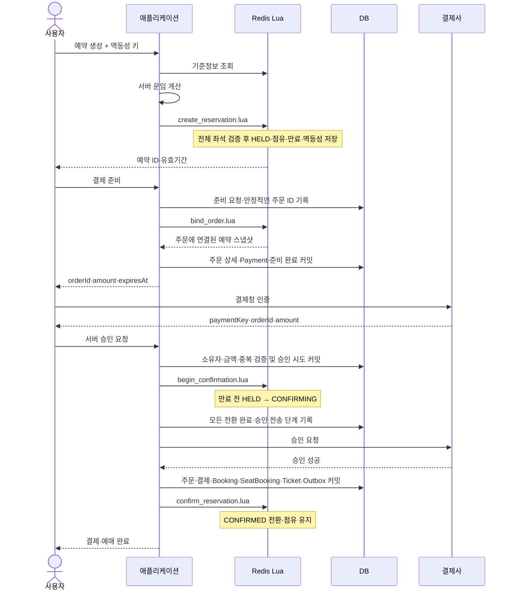

# 전체 흐름 — Happy case와 실패 case

[목록](README.md) · [로드맵](roadmap.md) · [설계 기준](01-decisions.md)

## 1. 범위와 상태

카드·간편결제 등 즉시 승인 결과를 확인하는 결제를 기준으로 한다. 프런트 결제창 인증과 서버의 결제 승인은 다른 단계다. 가상계좌 입금 대기는 별도 설계 대상이다.

| 단계 | Redis | DB | 좌석 |
|---|---|---|---|
| 예약 생성 | HELD, expiresAt | 예약 저장 없음 | 유효기간까지 점유 |
| 결제 준비 | HELD + orderId | 준비 진행 기록, 주문·결제·스냅샷 | 기존 유효기간 유지 |
| 결제창 인증 | HELD | 준비 완료 | 만료 가능 |
| 서버 승인 | CONFIRMING | 영속 승인 시도·진행 단계 | 자동 해제 금지 |
| 결제·예매 확정 | CONFIRMED | 주문·결제·예매·승차권·Outbox | 확정 점유 유지 |
| 취소·만료 | CANCELLED / EXPIRED | 필요 시 주문·실패 기록 | 해당 소유자의 구간 해제 |

## 2. Happy case



결제 준비의 선행 영속 기록은 프로세스 종료를 복구하기 위한 보완 제안이다. 실제 저장 위치는 [결제 준비 문서](07-payment-prepare.md)에서 구현 전에 확정한다.

### 단계별 문서

1. [예약 생성](04-reservation-create.md): DB 조회 없이 기준정보·운임·전체 구간 검사.
2. [결제 준비](07-payment-prepare.md): 주문 연결과 스냅샷, 준비 완료 이후에만 결제창 정보 응답.
3. [결제 승인](08-payment-confirm.md): 만료 재검사, 모든 예약의 CONFIRMING 전환, 외부 호출.
4. [예매 확정](09-booking-finalize.md): DB 원장 커밋과 Redis 확정 상태 반영.

## 3. 트랜잭션 경계

| 경계 | 함께 처리하는 내용 | 함께 묶이지 않는 대상 |
|---|---|---|
| 예약 Lua | 같은 운행의 상태·점유·인덱스 정상 전이 | 다른 hash slot, DB, 외부 API |
| 준비 DB 트랜잭션 | 주문 상세·Payment·준비 완료 | Redis 주문 연결 |
| 승인 시도 DB 트랜잭션 | 중복 방지·attempt·진행 단계 | Redis 전환, 외부 API |
| 예매 DB 트랜잭션 | 주문·결제·예매·승차권·Outbox | Redis 확정 |
| Redis 확정 Lua | 상태 전이·점유 검증·복구 인덱스 정리 | DB Outbox 처리 완료 표시 |

외부 결제 호출을 포함하는 긴 DB 트랜잭션을 두지 않는다. 각 간격의 프로세스 종료를 영속 기록으로 찾아 재시도한다. Lua 실행 오류도 자동 롤백으로 가정하지 않는다.

## 4. 실패 case

| 지점 | 실패·중단 | 즉시 처리 | 복구·최종 조건 |
|---|---|---|---|
| 생성 전 | 기준정보 없음·판매 차단 | 예약 거부 | 기준정보 복구·READY 후 재요청 |
| 생성 검증 | 유효한 좌석 점유 충돌 | 정상 검증 실패, 부분 선점 없음 | 새 요청으로 좌석 변경 |
| 생성 직후 | 응답 유실 | 성공 여부 불명 | 같은 멱등성 키로 결과 조회·재시도 |
| 생성 쓰기 중 | Lua 명령 오류 | 정상 충돌과 구분해 오류 처리 | 같은 operation의 데이터 대조, 필요 시 판매 차단 |
| 결제 준비 | 일부 주문 연결 실패 | 외부 승인 없음 | 동일 준비 기록 기준 조건부 연결 해제 |
| 결제 준비 | DB 커밋 결과 불명 | 신규 주문으로 무작정 재생성 금지 | 동일 orderId 조회 후 반환 또는 보상 |
| 결제창 | 이탈·인증 실패 | HELD 유지 | 기존 expiresAt에 만료 |
| 승인 전 | 예약 만료·소유자·점유 불일치 | 결제사 승인 호출 금지 | 승인 시도 종료 및 부분 전환 보상 |
| 승인 중 | 명확한 실패 | DB 실패·Outbox 저장 | 실패 Lua로 CANCELLED·소유 점유 해제 |
| 승인 중 | 타임아웃·연결 끊김 | CONFIRMING 유지 | 결제 조회·늦은 실행자 통제 후 결과 결정 |
| 승인 후 | 성공했지만 DB 커밋 실패 | 점유 유지 | DB 확정 재시도 또는 결제 취소 확인 후 해제 |
| 확정 후 | Redis 반영 실패 | DB 확정 결과 보존 | Outbox 재시도, 점유는 계속 보호 |
| 취소 | 결제 취소 결과 불명 | 점유 유지 | 취소 결과 확인 후 DB 기록·해제 |
| 공통 | Redis 유실·불완전 복구 | 해당 판매 차단 | DB 예매·진행 중 결제를 대조한 후 재개 |

## 5. 두 종류의 Worker 기한

```text
HELD + deadlines
  유효기간 지남 → expire Lua → EXPIRED·점유 해제

CONFIRMING + confirmation-deadlines
  확인 기한 지남 → DB·결제사 결과 조회
    성공 → DB 예매 확정·CONFIRMED
    실패/취소 확정 → CANCELLED·점유 해제
    불명 → 점유 유지·재조회/운영 복구
```

Worker가 늦어져도 HELD 유효기간은 늘어나지 않는다. 생성 Lua가 expiresAt을 검사해 만료된 점유를 재사용할 수 있다. 이후 만료 Worker는 현재 소유자가 같은 예약일 때만 지운다.

## 6. 다중 예약 결제

한 Order가 여러 운행 일정의 Reservation을 묶을 수 있다. 각 일정의 Lua는 따로 실행하고 모든 대상이 승인 진입에 성공한 뒤에만 결제사를 호출한다. 일부 실패 시 전환된 대상의 보상 진행을 DB에 남긴다.

처음에는 단일 Reservation 결제만 출시할 수 있다. 그 경우 API에서 다중 대상을 명시적으로 거부하고, 지원하지 않는 원자성을 암묵적으로 약속하지 않는다.

## 7. 완료 판단

- 예약 성공: Lua 정상 완료 또는 멱등성 재조회로 동일 예약 성공 확인.
- 결제 준비 성공: 모든 연결과 DB 준비 완료 확인. 응답 직후 만료될 수 있으므로 승인 때 재검사.
- 결제·예매 성공: 결제 승인과 DB 예매 커밋 확인. Redis 반영 지연은 내부 재시도 대상이지만 원본 점유가 보호된 상태여야 한다.
- 실패 완료: DB 실패 기록과 필요한 결제 취소가 확정되고, Redis 해제가 완료되거나 영속 재시도 작업으로 추적되는 상태.
- 결과 불명: 완료나 실패로 거짓 응답하지 않고 처리 중 상태와 조회 경로를 제공.
