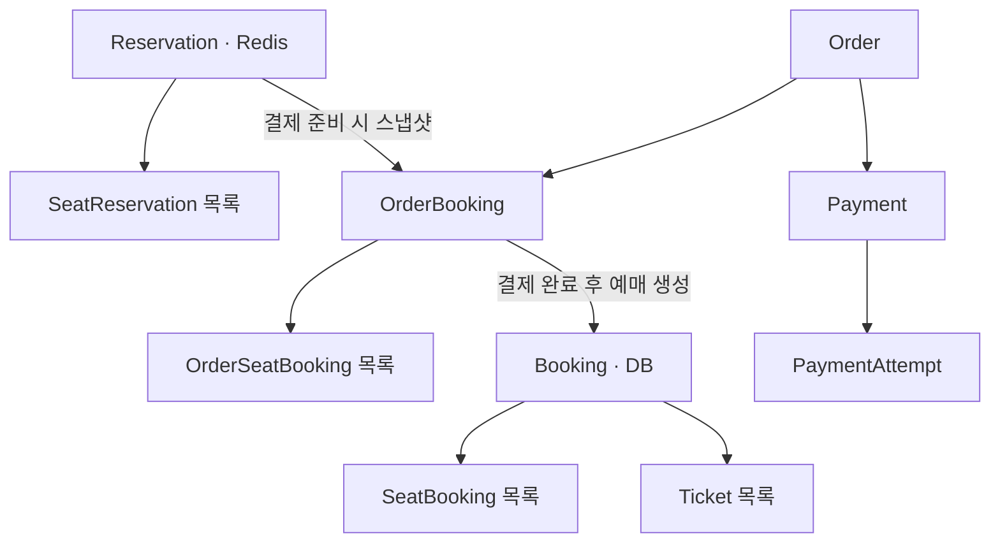
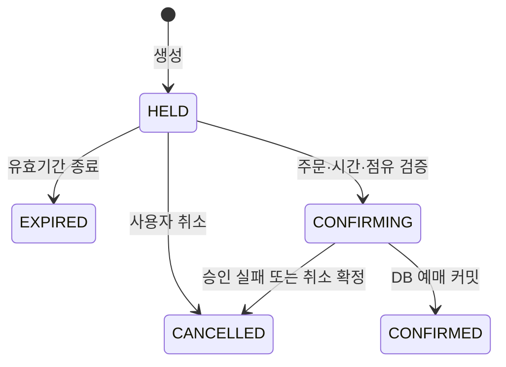

# 도메인 — DB와 Redis

[목록](README.md) · [설계 기준](01-decisions.md) · [Redis 키](12-redis-keys.md)

## 1. 기본 구조

| 저장소 | 모델 | 책임 |
|---|---|---|
| DB | Booking | 결제 완료된 예매와 취소 상태 |
| DB | SeatBooking | 확정 예매 좌석·이용 구간 |
| DB | Ticket | 좌석별 승차권·운임·사용 상태 |
| Redis | Reservation | 결제 전 예약, 유효기간, 주문 연결, 승인 진행 상태 |
| Redis 내부 값 | SeatReservation | 예약의 좌석·승객 유형·운임 |

SeatReservation은 별도 Redis 키가 아니다. Reservation 본문에 목록으로 직렬화한다. occupancy·deadlines·idempotency는 별도 도메인 엔티티가 아니라 저장소 자료구조다.



그림은 논리적인 관계이며 모두 JPA 양방향 컬렉션으로 구현한다는 뜻은 아니다. 현재 SeatBooking과 Ticket은 Booking을 참조한다. 조회 필요와 트랜잭션 범위에 맞춰 매핑한다.

## 2. Reservation

### 필드 제안

| 필드 | 역할 | 현재 코드 |
|---|---|---|
| id | 전역적으로 충돌하지 않는 예약 식별자 | 있음 |
| memberNo | 소유자 | 있음 |
| trainScheduleId | 원자적 처리·키 라우팅 단위 | 있음 |
| departureStopId / arrivalStopId | 주문 스냅샷·DB 연결 | 있음 |
| departureStopOrder / arrivalStopOrder | DB 없는 구간 검사·해제 | 추가 필요 |
| seatReservations | 예약 좌석 목록 | 있음 |
| totalFare | 좌석별 운임 합계 | 있음 |
| fareVersion | 적용한 운임 기준 | 추가 필요 |
| status | 예약 생명주기 | 추가 필요 |
| createdAt / expiresAt | 생성 시각·논리 유효기간 | createdAt만 있음 |
| orderId | 주문 연결 | 추가 필요 |
| confirmationAttemptId | 승인·복구 대상 식별 | 추가 필요 |
| version | Redis 예약 상태 전이 순서 | 추가 필요 |
| generation | 재고 복구 세대 | 추가 필요 |

`orderId`는 공개 주문 코드(orderCode)를 뜻할지 DB PK를 뜻할지 계약에서 명시한다. 이 문서의 API 예시는 토스에 전달하는 주문 코드를 orderId라고 표기한다. DB 내부 PK와 같은 타입·이름으로 혼용하지 않는다.

부분 취소·Outbox 순서 처리를 위해 적용된 DB 전이 순서와 취소된 좌석 범위도 필요하다. 상세 필드는 [Outbox](15-outbox.md)와 [예매 취소](11-booking-cancel.md) 구현 전에 결정한다. Redis `version`, DB 결과 순서, 복구 `generation`은 서로 다른 개념이다.

### 상태



HELD의 orderId 연결은 상태 변경이 아니다. CONFIRMING은 별도의 확인 기한을 가지며 원래 예약 유효기간으로 자동 삭제하지 않는다. CONFIRMED는 새 예약의 충돌 검사에 필요하므로 운행 판매 종료와 미완료 후속 작업 정리 전에는 삭제하지 않는다.

### 불변식

- 같은 운행 일정, 유효한 출발·도착 순서, 비어 있지 않은 좌석 목록.
- 좌석 중복 금지, 좌석 수와 승객 수 일치, 좌석의 운행 열차 소속 검증.
- 각 운임은 음수가 아니고 totalFare는 개별 운임 합계와 일치.
- 상태 변경과 좌석 점유 변경은 Lua 계약을 통해 함께 수행.
- Java 객체를 읽은 뒤 상태만 바꿔 전체 JSON을 덮어쓰는 방식으로 동시성을 해결하지 않음.
- Java의 입력/불변식 검증과 Lua의 현재 상태 조건 검사를 구분. Lua 판정을 최종으로 사용.

DB entity가 아닌 Reservation에는 JPA BaseEntity 상속을 강제하지 않는다. 현재 Lombok·생성 메서드는 재설계할 수 있으며 SeatReservation 목록은 외부 변경으로 예약 정보가 변하지 않도록 복사한다.

## 3. SeatReservation

```text
seatId
passengerType
fare              // 추가 제안: 예약 시 개별 운임 스냅샷
```

좌석 번호·객차명 같은 표시 정보를 예약 조회에서도 DB 없이 제공하려면 필요한 표시 스냅샷 또는 기준정보 참조를 결정한다. 좌석마다 다른 객차가 가능하므로 하나의 trainCarId를 요청 전체에 무조건 적용하지 않는다.

승객·좌석의 대응이 바뀌면 운임도 달라질 수 있다. 멱등성 요청 hash는 두 배열을 독립 정렬하지 않고 좌석·승객의 대응을 보존한 canonical 표현에서 계산한다.

## 4. Booking·SeatBooking·Ticket

| 모델 | 기존 주요 정보 | 새 구현에서 필요한 검토 |
|---|---|---|
| Booking | member, order, trainSchedule, departureStop, arrivalStop, bookingStatus, bookingCode | 원본 OrderBooking/Reservation 식별 연결, 중복 확정 방지 고유 제약 |
| SeatBooking | booking, seat, trainSchedule, passengerType, carType, 역 ID·정차 순서 | 원본 주문 좌석 연결, 부분 취소 후 조회·복구에서 활성 좌석 구분 |
| Ticket | booking, seat, passengerType, fare, ticketNumber, ticketStatus | 같은 주문 좌석에서 중복 발급 방지, 부분 환불·취소 연결 |

BookingStatus의 BOOKED/CANCELLED와 TicketStatus의 ISSUED/USED/CANCELLED는 활용한다. DB seat_booking의 현재 구간 인덱스는 조회 인덱스이며 중첩 구간의 유일성을 보장하는 제약이 아니다.

확정 점유의 영구 원장은 DB다. Redis에는 예약 허용 여부를 빠르게 판정할 확정 점유를 유지한다. 예매 취소 결과는 DB에 먼저 기록하고 소유자 조건으로 Redis를 해제한다. 복구 시 취소된 좌석을 다시 판매 완료 좌석으로 적재하지 않아야 한다.

## 5. 주문·결제 DB 모델

현재 테이블 명칭은 코드에 있는 것을 기준으로 표기하며 신규 항목은 제안이다.

| 테이블/기록 | 변경 | 역할 |
|---|---|---|
| orders | 확장 | 안정적인 orderCode, 멱등 준비 결과, 준비 완료 여부·주문 상태 |
| order_booking | 수정 | pending_booking_id → reservation_id, schedule·stop·운임 스냅샷 |
| order_seat_booking | 활용·보강 | 좌석·승객·fare 스냅샷, 확정 멱등성 원본 |
| payment | 확장 | 주문별 결제, paymentKey, 금액·승인/환불/실패 결과 |
| 결제 준비 진행 기록 | 저장 형태 미결정 | 주문 연결 전 준비 의도·진행을 영속 보관 |
| payment_attempt | 신규 제안 | 승인 시도·전송 단계·결과 불명·처리 권한·재시도 |
| payment_attempt_reservation | 다중 예약 결제 시 제안 | 각 예약의 승인 진입·보상 진행 상황 |
| outbox | 신규 제안 | DB 결과를 Redis에 재반영할 작업 |

준비 진행 기록은 orders의 준비 상태 필드로 통합하거나 별도 테이블로 둘 수 있다. 저장 방식을 선택하기 전 임시 이름의 테이블을 확정 스키마처럼 만들지 않는다. PaymentAttempt와 Outbox도 이 문서 작성 시점에는 구현되지 않았다.

### 승인 시도에 필요한 정보

`attemptId`, `paymentId`, 공개 주문 코드, paymentKey, 예약 참조(scheduleId/id/generation), 전송 여부를 포함한 진행 단계, provider 결과, 처리 owner/lease/version, 다음 확인 시각, 마지막 오류가 필요하다. 저장 단계와 이름은 [승인](08-payment-confirm.md)과 [복구](10-payment-failure-recovery.md)의 계약을 따른다.

승인 성공 응답을 받았지만 예매 DB 커밋이 실패한 상태를 최종 결제 실패로 덮어쓰지 않는다. 결제사의 사실과 우리 DB 처리 진척을 분리해 표현한다.

### 고유성·중복 방지 검토

- 주문 코드와 준비 멱등성 scope의 유일성.
- 주문의 허용된 활성 승인 시도 개수. 조회 후 INSERT만으로 보호하지 않음.
- 원본 OrderBooking에서 Booking을 한 번만 생성, 원본 주문 좌석에서 Ticket을 한 번만 발급.
- Outbox deduplication key와 대상별 적용 순서.
- 일반 복구 재시도와 사용자 새 결제 시도를 구분. 같은 키를 다른 payload로 사용하면 거부.

## 6. 구현 확인 항목

- [ ] ReservationStatus와 시간 직렬화 규칙 정의.
- [ ] SeatReservation fare와 목록 불변성 반영.
- [ ] 상태 전이 오류를 도메인/비즈니스 예외로 구분.
- [ ] 주문 스냅샷부터 확정 예매·승차권까지 원본 식별자 추적.
- [ ] 다중 예약 진행 기록·준비 기록의 저장 형태 결정.
- [ ] 확정 점유를 DB에서 복원할 필드·취소 상태 검증.
- [ ] 신규 ErrorCode는 [프로젝트 에러 코드 규칙](../error-code-convention.md) 적용.
