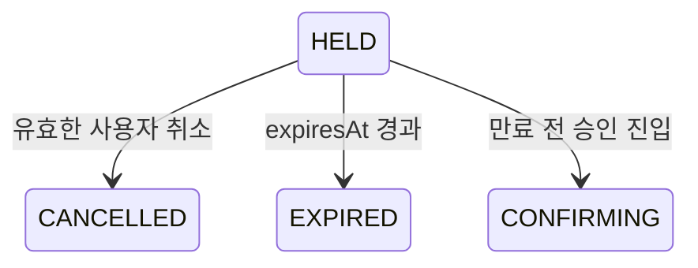

# 예약 취소·만료

> 구현 예정 설계다. 이 문서는 결제 승인 진입 전 `HELD` 예약을 종료하는 흐름을 다룬다. 이벤트는 발행하지 않는다.

[문서 목록](./README.md) · [이전: 예약 조회](./05-reservation-query.md) · [다음: 결제 준비](./07-payment-prepare.md)

## 목적과 상태 전이

사용자 취소와 예약 시간 경과 시 좌석 점유를 반환한다. 예약 본문은 종료 상태로 보존하며, 모든 삭제는 현재 점유 소유자를 확인한다.



`CONFIRMING`은 일반 취소·만료 Lua가 해제하지 않는다. [결제 실패·복구](./10-payment-failure-recovery.md)에서 결과 확인 후 처리한다. `CONFIRMED`의 해제는 DB 예매 취소 확정 이후 [예매 취소](./11-booking-cancel.md) 경로만 사용한다.

## 읽기·쓰기 대상

| 대상 | 취소·만료 시 역할 |
|---|---|
| `reservations` | 회원·상태·구간·시각 확인, 종료 상태·버전·종료 시각 저장 |
| `occupancy` | 해당 예약이 아직 소유하는 좌석·구간 필드만 삭제 |
| `deadlines` | 종료 처리된 예약을 후보 목록에서 제거 |
| `idempotency` | 즉시 삭제하지 않음. 생성 재시도에 기존 종료 상태 제공 |
| DB | 주문이 연결된 경우 후속 주문 정리·복구에서 참조 |

예약 본문이 담고 있는 좌석과 구간으로 점유 필드를 계산한다. 클라이언트가 삭제할 좌석 목록을 임의로 지정하게 하지 않는다.

## 사용자 취소

```text
입력: trainScheduleId, reservationId, 인증된 memberNo
호출: cancel_reservation.lua
```

1. 입력·키 타입·예약 본문을 검증한다.
2. 예약 소유자가 인증된 회원인지 확인한다.
3. 현재 상태를 확인한다. 이미 `CANCELLED/EXPIRED`이면 종료 결과를 반환한다.
4. `HELD`이고 만료 전이면 `CANCELLED`, 이미 만료됐다면 `EXPIRED`로 종료한다.
5. 원래 소유자가 일치하는 점유만 삭제하고 종료 상태·시각·버전을 저장한다.
6. `deadlines`에서 예약 ID를 제거한다.

만료 후 취소 요청의 구체적인 HTTP 응답은 API 정책으로 정한다. 종료 상태를 되돌리거나 예약 시간을 연장하지 않는 것이 핵심이다. `CONFIRMING/CONFIRMED`에 일반 취소를 허용하지 않는다.

## 예약 만료 Worker

Worker는 처리할 운행 일정별 `deadlines`에서 `score <= 현재 시각`인 예약 ID를 제한된 배치로 읽는다. 예를 들어 1초 주기·100개 배치를 사용할 수 있지만 실제 수치는 설정·부하 검증으로 결정한다.

```text
deadlines
  res_A → 10:10
  res_B → 10:15

10:11 Worker 조회
  후보 = [res_A]
  expire_reservation.lua(res_A) 호출
```

**후보를 먼저 POP·삭제하지 않는다.** 조회와 실행 사이에 서버가 종료되어도 다음 Worker가 다시 찾을 수 있어야 한다. 후보 조회의 시계 오차가 조기 해제로 이어지지 않도록 최종 판단은 Lua의 Redis `TIME`으로 수행한다.

## `expire_reservation.lua`

1. 현재 예약 본문과 상태를 다시 읽는다.
2. `HELD`이고 `expiresAt <= Redis now`인지 확인한다.
3. 모든 해제 대상·키 타입·본문을 검증한 뒤 쓰기를 시작한다.
4. 해당 예약이 소유한 점유 필드만 삭제한다.
5. Reservation을 `EXPIRED`로 전환하고 종료 시각·버전을 갱신한다.
6. `deadlines`에서 제거한다.

이미 종료된 예약은 성공적으로 처리한 중복 요청으로 취급할 수 있다. 종료 상태인데 남은 점유·인덱스가 있으면 불변식에 따라 멱등 정리한다. `CONFIRMING/CONFIRMED`는 점유를 유지하며 잘못 남은 일반 만료 인덱스만 안전하게 보정한다.

예약 본문이 없어서 소유 좌석을 알 수 없다면 전체 점유를 추측해서 지우지 않는다. 이상을 기록하고 격리·복구하며, 동일한 불량 후보 때문에 뒤의 정상 만료가 계속 막히지 않도록 처리량과 재시도를 제한한다.

## 승인 진입과의 경합

```text
만료가 먼저 성공:
  HELD → EXPIRED → 점유 해제
  승인 진입은 EXPIRED를 확인하고 거부 → 결제사 호출 없음

만료 전에 승인 진입이 먼저 성공:
  HELD → CONFIRMING
  deadlines 제거 + confirmation-deadlines 등록
  만료 Lua는 현재 CONFIRMING을 확인 → 점유 유지
```

Worker가 `HELD`를 조회한 뒤 승인 진입이 발생해도 실제 만료 Lua는 최신 상태를 읽는다. 이미 `expiresAt`이 지난 경우에는 승인 진입 Lua가 먼저 실행돼도 전환을 거부한다.

## Worker 지연과 점유 재사용

```text
10:10 res_A 만료, Worker는 아직 실행되지 않음
10:11 새 예약 Lua가 res_A의 논리 만료 확인
      13:0 → res_D로 변경
10:12 만료 Worker가 res_A 정리
      13:0의 소유자는 res_D → 유지
      13:1의 소유자는 res_A → 삭제
```

Worker는 물리 정리를 담당한다. 예약이 유효한지는 `expiresAt`이 결정하므로 Worker 지연으로 예약 시간이 늘어나지 않는다.

여러 Worker가 같은 예약을 가져가도 Lua에서 상태·소유자를 재확인하므로 중복 실행에 안전해야 한다. 런타임 오류 이후의 부분 쓰기는 별도 대조·복구 대상이며 Lua의 실행 원자성이 자동 롤백을 뜻하지 않는다.

## 주문이 연결된 예약의 종료

결제 준비 후에도 `HELD`는 원래 기한에 종료될 수 있다. Redis 취소·만료와 DB 주문 상태 변경은 하나의 트랜잭션이 아니다.

- 승인 API는 항상 Redis 상태·만료·점유를 재검증하므로 오래된 DB `PENDING`만 보고 승인하지 않는다.
- 주문의 유효기한과 예약 참조를 DB에 보존하고, 기한 지난 미완료 주문을 대조·정리한다.
- 다중 예약 주문 중 하나가 종료되면 결제를 시작하지 않는다. 나머지 예약의 주문 연결 해제 정책은 결제 준비 문서에서 정한다.
- 예약 종료를 Redis Stream에 발행하는 방식은 사용하지 않는다. DB 정리 누락은 주기적 대조로 복구한다.

## 보존 데이터 정리와 수용 기준

종료 예약과 멱등성 기록의 물리 삭제는 [Worker](./14-workers.md)의 별도 보존 정책을 따른다. 활성 점유가 참조하는 본문과 `CONFIRMING/CONFIRMED` 본문을 임시 예약 TTL로 삭제하지 않는다.

- [ ] 취소·만료가 다른 예약의 점유를 해제하지 않는다.
- [ ] 여러 좌석의 취소·만료에서 종료 상태와 점유·인덱스가 일치한다.
- [ ] 조회와 실행 사이의 승인 진입을 재검증한다.
- [ ] 취소·만료 재시도와 다중 Worker 실행이 중복 상태 전이를 만들지 않는다.
- [ ] Worker 중단 후 만료 후보를 다시 처리할 수 있다.
- [ ] 이미 만료된 점유를 새 요청이 즉시 재사용할 수 있다.
- [ ] 결제 중인 점유는 일반 만료로 해제하지 않는다.
- [ ] 종료 예약을 참조하는 주문과 멱등성 기록의 후속 정리 정책이 있다.

관련 문서: [전체 흐름](./02-overall-flow.md), [Redis 키](./12-redis-keys.md), [Lua 계약](./13-lua-scripts.md).
