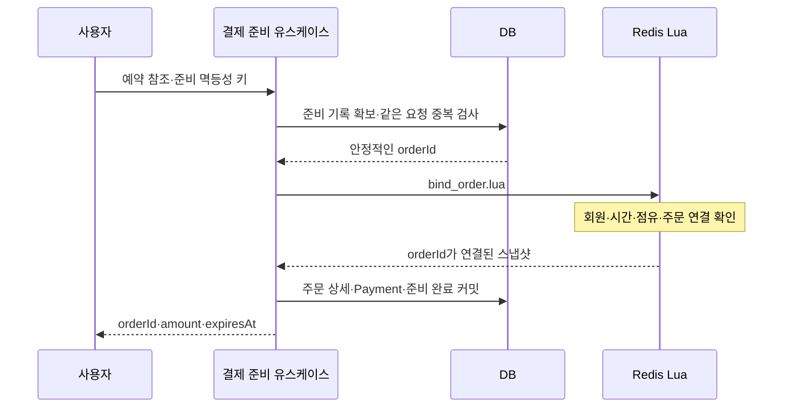

# 결제 준비

[목록](README.md) · [이전: 예약 취소·만료](06-reservation-cancel-expire.md) · [다음: 결제 승인](08-payment-confirm.md)

> 구현 예정 설계. 준비 요청·주문 연결·DB 스냅샷을 생성한다. 결제 승인이나 CONFIRMING 전환은 하지 않는다.

## 1. 계약과 선행 조건

```text
입력: reservationRefs[{trainScheduleId, reservationId}], 준비 멱등성 키
인증: memberNo
결과: orderId(공개 주문 코드), amount, expiresAt
```

각 예약은 본인 소유이며 HELD·만료 전이어야 한다. 원래 좌석·구간의 소유자도 해당 예약이어야 한다. 동일 예약 ID 중복 입력을 거부한다. 여러 예약을 묶는 경우 표시할 expiresAt은 대상 예약의 가장 이른 만료 시각을 기준으로 한다.

## 2. 읽기·쓰기

| 대상 | 처리 |
|---|---|
| Redis reservations | 소유자·상태·시간·운임·버전 조회, orderId 연결 |
| Redis occupancy | 예약이 모든 대상 구간을 소유하는지 확인 |
| Redis meta | 세대·판매/승인 허용 조건 확인 |
| DB 준비 기록 | 준비 요청·주문 코드·진행·멱등성 결과 저장 |
| DB orders/order_booking/order_seat_booking/payment | 결제 대상과 운임 스냅샷 저장 |

예약 생성용 Redis idempotency와 결제 준비용 DB 멱등성은 다른 작업의 기록이다. 준비 요청이 재시도될 때마다 새 주문 코드를 만들지 않는다.

## 3. 준비 진행 기록을 먼저 남기는 보완안

단순히 Redis 연결 후 DB INSERT만 하면 연결 직후 서버 종료 시 복구 근거가 부족하다. 다음 흐름을 권한다.

1. 짧은 DB 트랜잭션으로 준비 요청과 안정적인 주문 코드를 저장한다.
2. 대상 예약을 Lua로 주문에 연결한다.
3. 모든 연결 성공 후 스냅샷으로 Order·주문 상세·Payment와 준비 완료 결과를 커밋한다.
4. 커밋을 확인한 후 결제창용 응답을 반환한다.

준비 기록은 별도 테이블로 둘지 orders의 준비 상태로 둘지 결정해야 한다. 현재 Order는 생성 시 회원·총금액이 필요하므로 미완료 Order를 임의의 정상 PENDING 주문처럼 노출하지 않는다. 준비 중/실패/완료를 구분하고 준비 완료 전에는 승인 API를 거부한다.

이 기록의 목적은 모든 임시 예약의 DB 저장이 아니다. 결제를 시작한 준비 요청만 추적한다.

## 4. 처리 순서



바인딩 시 HELD 상태와 expiresAt을 변경하지 않고 orderId·version을 갱신한다. 같은 주문의 재시도면 동일 연결을 확인한다. 다른 활성 주문에 이미 연결됐다면 거부한다.

스냅샷은 좌석별 passengerType·fare, totalFare, 운행·역·구간, reservationId·generation·관련 버전을 포함한다. 결제 준비 시 DB 연관 엔티티 조회는 허용하지만 금액을 조용히 재계산하지 않는다. 예약 운임 고정 정책은 [D1](01-decisions.md)을 따른다.

## 5. 실패와 보상

| 상황 | 처리 |
|---|---|
| 예약 만료·소유자 오류 | 준비 실패. 외부 결제 호출 없음 |
| 다른 주문에 연결 | 중복 준비 거부 또는 기존 준비 결과 안내 정책 적용 |
| 여러 운행 중 일부 연결 실패 | 성공한 연결만 동일 준비 작업 기준 unbind 재시도 |
| 연결 후 DB INSERT 실패 | 커밋 여부가 확실한 실패라면 조건부 연결 해제 |
| DB 커밋 결과 불명 | 같은 주문 코드·준비 키로 DB 조회, 확정 전 해제 금지 |
| 응답 유실 | 같은 키로 준비 결과 조회·반환 |
| 연결 도중 서버 종료 | DB 미완료 준비 기록으로 연결 대조·완료 또는 보상 |
| 완료 직후 예약 만료 | 준비 스냅샷은 남지만 승인 진입에서 만료 거부 |

`unbind_order.lua`는 해당 준비 작업의 주문이 연결된 HELD에만 적용한다. CONFIRMING이나 다른 주문을 해제하지 않는다. 연결 해제는 좌석 취소와 별개이며 만료 시각을 연장하지 않는다. 이미 만료된 예약은 만료 경로에서 정리한다.

준비 복구 Worker와 원래 실행자가 경쟁할 때 완료와 보상이 동시에 확정되지 않도록 DB 준비 기록의 조건부 상태 전이를 사용한다. 중단된 실행자가 나중에 준비 완료를 저장하는 것도 차단한다.

## 6. 현재 연동에서 바꿀 부분

- PaymentPrepareService의 PendingBookingReader·SeatConflictValidator 계약을 예약 스냅샷·원자적 바인딩 계약으로 대체한다.
- OrderRegister는 원본 예약 스냅샷의 금액·좌석 매핑을 보존한다.
- 공개 API가 pendingBookingIds를 사용 중이면 새 reservationRefs 계약과 마이그레이션 여부를 정한다.
- payment port/adapter와 프로젝트 레이어 규칙을 유지한다. [구성 문서](16-architecture.md)

## 7. 수용 기준

- [ ] 동일 준비 요청은 같은 주문 결과로 수렴한다.
- [ ] 동일 예약이 두 활성 주문에 동시에 귀속되지 않는다.
- [ ] 부분 바인딩과 커밋 불명 상태를 복구할 수 있다.
- [ ] 준비 과정에서 예약 유효기간을 연장하지 않는다.
- [ ] 주문·좌석·결제 금액이 예약 스냅샷과 일치한다.
- [ ] 결제창 이탈과 준비 중 서버 종료를 추적할 수 있다.
- [ ] 준비 완료 전의 주문으로 결제 승인을 시작할 수 없다.
