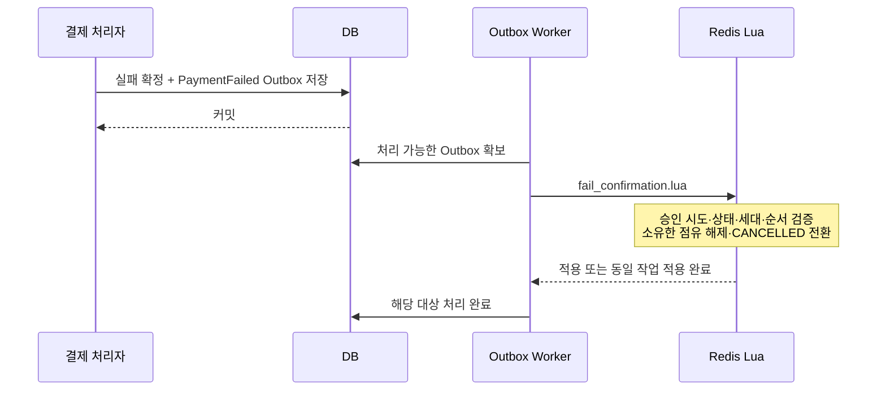

# 결제 실패와 복구

> 구현 예정 설계다. 결제 실패와 결제 결과 미확인을 구분하고, 승인 성공 또는 실패를 확인한 뒤 좌석 점유를 정리한다. 예약 생성용 Redis Stream은 사용하지 않는다.

이전: [예매 확정](09-booking-finalize.md) · 관련: [Worker](14-workers.md), [Outbox](15-outbox.md), [설계 결정](01-decisions.md)

## 1. 목적과 완료 조건

- 승인 응답 유실, 프로세스 종료, DB 커밋 실패, Redis 반영 실패를 복구한다.
- 승인 가능성이 남아 있는 예약은 `CONFIRMING`으로 점유를 유지한다.
- 결제 실패·취소가 확정되면 해당 승인 시도가 소유한 점유만 해제한다.
- 재시도 횟수 초과를 결제 실패로 간주하지 않는다. 복구가 끝나지 않았다는 상태를 보존한다.

## 2. 실패 분류

| 상황 | DB 기록·후속 처리 | Redis 처리 |
|---|---|---|
| 주문·소유자·금액 검증 실패 | 승인 시도 시작 전 거부 | 기존 `HELD` 만료 정책 유지 |
| 승인 진입 시 예약 만료 | 외부 승인 미호출을 기록하고 시도 종료 | 만료 처리 또는 이미 종료된 상태 유지 |
| 여러 예약 중 일부만 승인 진입 | 외부 승인 미호출을 보장한 후 전환된 예약 보상 | 해당 시도에 귀속된 예약만 조건부 취소 |
| 결제사의 명확한 승인 실패 | 실패 상태와 `PaymentFailed` Outbox를 함께 커밋 | `CANCELLED`, 소유 점유 해제 |
| 승인 요청 타임아웃·연결 끊김 | 결과 미확인 기록, 결제 조회 예약 | `CONFIRMING` 유지 |
| 승인 성공 후 DB 예매 저장 실패 | 성공 증거 보존, 확정 재시도 또는 취소 보상 | `CONFIRMING` 유지 |
| DB 확정 후 Redis 반영 실패 | 기존 Outbox 재처리 | 확정 전환 전까지 점유 유지 |
| Redis 데이터 누락·복구 세대 불일치 | 장애 복구 대상으로 등록 | 해당 운행 판매 차단·대조 후 복구 |

결제사가 반환한 오류도 모두 최종 승인 실패로 분류하지 않는다. 이미 처리된 결제, 서버 오류, 응답 해석 실패 등은 오류 코드별로 조회·재시도 정책을 정한다.

## 3. 복구 가능한 승인 시도 기록

외부 승인 호출과 Redis `CONFIRMING` 전환 전에 DB에 승인 시도를 저장한다. 제안 필드는 다음과 같다.

| 정보 | 용도 |
|---|---|
| `attemptId`, `paymentId`, `orderId` | 논리적 승인 작업 식별 |
| `paymentKey`, 승인 요청 스냅샷 | 같은 결제 조회·동일 요청 재시도 |
| 예약 참조 목록 | 운행 ID·예약 ID·복구 세대·기대 버전·예약별 진행 상황 |
| 처리 단계·외부 결과 | 승인 준비, 호출 결과 미확인, 승인 성공, 확정 완료, 실패·취소 완료 구분 |
| 처리 소유자·lease·fencing token | API 처리자와 복구 Worker의 DB 변경 권한 통제 |
| `nextRetryAt`, 재시도 수, 마지막 오류 | 제한된 재시도·운영 복구 |

구체적인 상태 enum과 테이블 이름은 [도메인 문서](03-domain-model.md)에서 확정한다. `PaymentStatus` 하나로 내부 복구 단계까지 표현하지 않는다.

## 4. 실패 확정 후 정리



Lua는 `reservationId`, `orderId`, `attemptId`, `generation`, 기대 상태·버전과 DB 반영 순서를 확인한다. 다음 정보만 제거한다.

```text
occupancy의 값이 현재 예약 ID인 좌석·구간
deadlines / confirmation-deadlines의 해당 예약 항목
```

예약 본문은 `CANCELLED`와 종료 사유를 남기고 보존한다. 예약이 이미 확정됐거나 더 최신 시도가 진행 중이면 오래된 실패 명령을 적용하지 않는다. 그 차이가 정상적인 중복인지 상태 충돌인지 구분하여 DB 처리 결과에 남긴다.

## 5. 결과 미확인 상태 복구

1. DB에서 기한이 지난 미완료 승인 시도를 배치로 조회한다.
2. 조건부 갱신으로 처리 권한을 확보하고 현재 DB 상태를 다시 확인한다.
3. DB에서 이미 확정됐다면 Outbox의 Redis 반영을 재개한다.
4. 외부 호출 가능성이 있다면 결제사의 결제 조회 결과를 확인한다.
5. 승인 성공이면 예매 확정을 재시도한다. 확정이 불가능하면 취소 보상을 진행한다.
6. 최종 실패·취소가 확인되면 실패·취소 기록과 Outbox를 커밋한다.
7. 여전히 불명확하면 점유를 유지하고 다음 확인 시각을 저장한다.

토스는 `paymentKey` 또는 `orderId`로 결제를 조회할 수 있다. 어떤 조회 결과를 확정 실패로 볼지는 사용하는 API와 결제 상태를 기준으로 정의한다. [토스 코어 API](https://docs.tosspayments.com/reference)

### 승인 요청이 늦게 발송될 수 있는 경계

다음 순서는 DB lease만으로 해결되지 않는다.

```text
API 처리자 A가 승인 호출 직전에 멈춤
→ lease 만료 후 Worker B가 복구 시작
→ 결제 조회 결과가 아직 없음
→ A가 재개되어 승인 호출
```

따라서 **lease 만료나 결제 조회의 not-found만으로 실패 확정·점유 해제를 해서는 안 된다.** DB fencing token은 오래된 DB 쓰기를 막을 수 있지만 이미 멈춘 프로세스의 외부 호출을 취소하지 못한다.

구현 전 다음 계약을 확인해야 한다.

- 승인 dispatch 권한을 어떻게 발급·폐기하고 오래된 호출자를 차단할지 정한다.
- 결제사가 지원하는 멱등성 키의 적용 API·동일 요청 범위·보존 기간을 확인한다.
- 승인과 취소·조회가 경합할 때 언제 외부 상태를 최종 종료로 판단할지 정한다.
- 안전한 종료를 증명할 수 없으면 자동 해제하지 않고 운영 복구로 넘긴다.

이는 [결제 승인](08-payment-confirm.md)의 구현·출시 전 필수 결정 사항이다. 예제 설계만으로 외부 결제 호출까지 정확히 한 번 실행된다고 보장하지 않는다.

## 6. 승인 성공 후 DB 실패

DB 확정 트랜잭션이 실패했다면 먼저 기존 커밋 여부를 확인한다. 커밋 여부가 불명확한 상태에서 Booking을 새로 만드는 대신 주문·승인 시도 고유 제약으로 기존 결과를 찾는다.

예매 확정 재시도가 불가능할 때는 승인 취소를 진행한다. **취소 요청 전송이 아니라 취소 완료 확인 이후** 좌석 해제를 허용한다. 취소 응답이 유실돼도 동일하게 조회·복구한다.

## 7. 여러 예약을 결제하는 경우

- 예약별 `CONFIRMING` 진입과 보상 결과를 DB에 기록한다.
- 전체 진입이 완료되기 전에는 외부 승인을 호출하지 않는다.
- 부분 진입 실패 시 외부 호출이 시작되지 않았음을 확인한 뒤 성공한 진입을 보상한다.
- 운행 일정이 다르면 Lua를 따로 실행한다. 전체 성공 여부는 DB 진행 기록으로 판단한다.
- 일부 정리만 끝났다면 나머지 대상을 재시도하며 전체를 완료로 표시하지 않는다.

## 8. 재시도와 운영 복구

일시 오류는 설정 가능한 지수 backoff와 jitter로 재시도한다. 최대 재시도 수·최대 경과 시간을 넘으면 `MANUAL_REVIEW` 같은 별도 복구 상태로 전환하고 알린다. 이는 제안 상태명이며 결제 실패 확정을 뜻하지 않는다.

운영자는 주문·승인 시도·결제사 결과·예약 소유자를 대조하여 확정 또는 취소를 결정한다. 수동 작업도 같은 유스케이스·멱등 Lua를 사용하고, 임의 Redis 삭제로 처리하지 않는다.

## 9. 검증 항목

- [ ] 외부 승인 전·후 각 경계에서 프로세스를 종료해 복구할 수 있다.
- [ ] 응답 유실 후 중복 승인 요청이 새 예매를 만들지 않는다.
- [ ] 승인 성공 후 DB 실패·취소 응답 유실을 구분한다.
- [ ] 오래된 처리자가 재개돼도 새 시도나 새 점유를 해제하지 않는다.
- [ ] 조회 not-found·lease 만료만으로 좌석을 해제하지 않는다.
- [ ] 재시도 한도 초과 시 실제 상태와 운영 복구 대상을 보존한다.

다음: [예매 취소](11-booking-cancel.md) · 전체 검증: [검증과 전환](17-validation-cutover.md)
