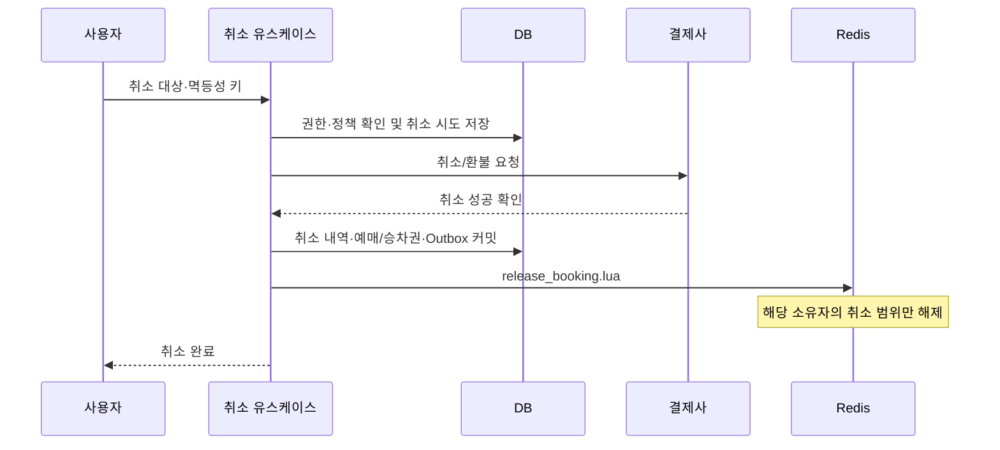

# 예매 취소·부분 취소

[목록](README.md) · [예매 확정](09-booking-finalize.md) · [실패·복구](10-payment-failure-recovery.md)

> 구현 예정 설계. 결제 전 HELD 예약 취소와 구분한다. 예매 취소는 결제사 환불/취소와 DB 확정 기록을 근거로 점유를 해제한다.

## 1. 선행 조건

- 회원의 예매·승차권 소유자 확인.
- 승차권 사용 상태, 출발 시각, 취소 가능 범위·수수료·환불 정책 확인.
- 원본 주문 좌석·Booking·SeatBooking과 Redis 예약·구간을 연결.
- 동일 취소 요청과 중복 환불을 구분할 안정적인 취소 operation ID 확보.
- 이미 취소된 좌석과 새로 취소하는 좌석의 금액·범위 분리.

부분 환불 금액·Payment 상태 표현은 기존 enum만으로 충분한지 검토한다. 일부 취소를 전체 REFUNDED로 잘못 표시하지 않는다. 현재 Payment 도메인의 취소/환불 메서드를 이름만 보고 재사용하지 말고 상태 전이 조건을 확인한다.

## 2. 처리 흐름



PG 취소 요청도 DB 트랜잭션 밖에서 실행한다. 성공 여부가 불명확하면 좌석을 유지하고 같은 취소 시도로 조회·복구한다. 외부 환불이 필요 없는 정책상 취소라면 그 근거를 기록하고 DB 취소 확정으로 진행한다.

## 3. DB 변경

하나의 트랜잭션에서 취소/환불 결과, 취소된 좌석·승차권, Booking 상태, BookingCancelled Outbox를 함께 기록한다.

SeatBooking은 활성 점유 원장으로 활용할 수 있지만, 행을 삭제하는 경우에도 원래 좌석·구간·환불 내역을 취소 기록과 Outbox에 남겨야 한다. 활성 여부 필드를 둘지 물리 삭제+이력을 사용할지는 구현 전에 확정한다.

일부 좌석만 취소되면 나머지 Booking·Ticket은 계속 유효하다. 모든 좌석이 취소된 경우에 Booking을 CANCELLED로 전환한다. 주문 전체와 단일 Booking의 취소를 혼동하지 않는다.

## 4. Redis 해제

```text
res_A: 좌석 12·13, 서울(0) → 동대구(2), CONFIRMED
취소 대상: 좌석 12

해제: 12:0, 12:1 (현재 소유자가 res_A인 경우)
유지: 13:0, 13:1
```

`release_booking.lua`는 다음을 검증한다.

1. 세대·원본 예약·Booking/주문 연결·DB 취소 operation·순서.
2. 해제 범위가 DB에서 취소한 원래 예매 좌석 범위에 포함되는지.
3. 해당 범위의 현재 점유 소유자가 같은 예약인지.

일치하는 점유만 해제하고 적용된 취소 ID·순서·범위를 기록한다. 새로운 예약이 해당 좌석을 재사용한 뒤 늦게 온 취소 작업은 새 소유자를 삭제하지 않는다.

부분 취소 후 Reservation은 남은 확정 점유를 대표하도록 유지하고 취소 범위를 별도 기록한다. 전부 취소되면 CANCELLED와 취소 사유로 종료할 수 있다. 이는 기존 상태 모델의 후속 확장이며 정확한 저장 필드는 D8에서 결정한다.

## 5. 순서와 실패

| 상황 | 처리 |
|---|---|
| 결제 취소 실패 확정 | 예매·점유 유지, 실패 결과 제공 |
| 취소 응답 유실 | 같은 operation으로 조회·복구, 해제 보류 |
| 취소 성공 후 DB 실패 | DB 취소 확정 재시도, 점유 보수적으로 유지 |
| DB 취소 후 Redis 실패 | Outbox 재시도 |
| 취소 Outbox가 확정 Outbox보다 먼저 선택 | 선행 처리 또는 DB 최종 상태 대조 복구 |
| 취소 후 오래된 확정 Outbox 도착 | 취소 순서를 확인하고 점유 부활 금지 |
| 다른 소유자가 이미 점유 | 취소 대상의 과거 작업인지 DB 대조, 새 소유자 유지 |

취소 복구는 PaymentRecoveryWorker의 취소 배치에서 처리하거나 같은 계약의 별도 실행기로 분리한다. 서버에서 오래 기다리는 동안 예약을 선제 해제하지 않는다.

## 6. 수용 기준

- [ ] 같은 취소 요청으로 환불·Outbox가 중복 생성되지 않는다.
- [ ] 사용된 승차권 등 취소 불가 조건이 거부된다.
- [ ] 부분 취소된 좌석만 해제되고 남은 승차권·금액이 일치한다.
- [ ] 취소 결과 불명·DB 실패·Redis 실패가 각각 복구된다.
- [ ] 늦은 취소가 새 예약을 지우지 않고 늦은 확정이 취소 점유를 부활시키지 않는다.
- [ ] Redis 재구축에서 취소된 좌석을 확정 재고로 다시 적재하지 않는다.
