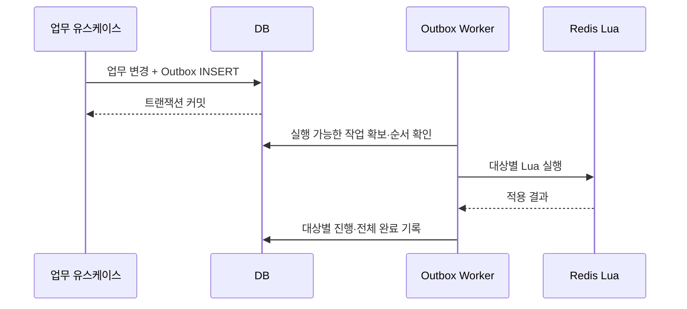

# DB Outbox와 Redis 반영

> 구현 예정 설계다. 예약 생성용 Redis Stream과 예약 DB 테이블은 만들지 않는다. DB에 확정된 결제·예매 결과를 Redis에 반드시 재시도할 수 있도록 DB Outbox를 사용한다.

관련: [예매 확정](09-booking-finalize.md), [결제 복구](10-payment-failure-recovery.md), [예매 취소](11-booking-cancel.md)

## 1. 필요한 이유

다음 두 저장소 변경은 하나의 트랜잭션이 아니다.

```text
DB에서 결제·예매 확정 커밋
→ Redis Reservation 확정
```

DB 커밋 직후 서버가 종료되면 Redis에 `CONFIRMING`이 남는다. DB 업무 변경과 같은 트랜잭션으로 Outbox를 저장하면 종료 후에도 반영할 작업을 찾을 수 있다.

Outbox는 브로커를 요구하지 않는다. Worker가 DB 작업을 읽고 해당 Lua를 직접 호출한다. Redis 응답 후 DB 완료 기록 전에 종료되면 중복 전달되므로 정확히 한 번 전달을 가정하지 않는다.

## 2. 필요한 논리적 이벤트

| 타입 | 생성 트랜잭션 | Redis 반영 |
|---|---|---|
| `BookingConfirmed` | Payment·Order 확정, Booking·SeatBooking·Ticket 생성 | `CONFIRMING → CONFIRMED`, 점유 유지 |
| `PaymentFailed` | 외부 승인 실패 또는 안전한 승인 중단 확정 | 해당 시도 예약 취소·점유 해제 |
| `BookingCancelled` | 예매 취소 확정·좌석별 취소 결과 기록 | 취소된 좌석·구간의 점유 해제 |

`ReservationCreated`, `ReservationExpired` 등의 Redis 이벤트는 이 설계에 없다. 결제 성공 후 취소 보상의 기록을 어느 Outbox 타입에 연결할지는 Booking 생성 여부에 따라 확정한다. 이미 생성된 예매를 취소했다면 `BookingCancelled`, 예매 없이 결제를 취소했다면 승인 시도의 최종 취소 사유를 포함한 정리 작업을 사용한다.

`PaymentFailed`라는 이름만으로 결제 취소 완료와 최초 승인 실패를 혼동하지 않도록 `terminalReason`과 실제 결제 결과를 기록한다. 이벤트 이름은 코드 구현 전 확정할 논리 명칭이다.

## 3. 레코드와 payload

| Outbox 필드 | 목적 |
|---|---|
| `id`, `type`, `schemaVersion` | 작업·payload 버전 식별 |
| `aggregateId`, `sequence` | DB 업무 변경과 순서 식별 |
| `deduplicationKey` | 같은 논리 변경의 중복 INSERT 방지 |
| `payload` | 대상과 기대 상태의 불변 스냅샷 |
| `status`, `nextRetryAt`, `retryCount` | 처리·재시도 상태 |
| 처리 소유자·lease·마지막 오류 | 다중 Worker·장애 복구 |
| `createdAt`, `processedAt` | 지연 관측·보존 정책 |

예시 payload는 다음과 같다. 실제 ID 형식과 JSON 직렬화는 구현에서 확정한다.

```json
{
  "orderId": "order_001",
  "paymentAttemptId": "attempt_001",
  "terminalReason": "APPROVED",
  "reservationRefs": [
    {
      "trainScheduleId": 1785,
      "reservationId": "res_A",
      "generation": 1,
      "expectedVersion": 3,
      "reservationSequence": 1,
      "bookingId": "booking_001",
      "seatSections": [
        { "seatId": 12, "departureStopOrder": 0, "arrivalStopOrder": 2 }
      ]
    }
  ]
}
```

`reservationSequence`는 해당 예약에 적용할 DB 확정·취소 변경의 순서다. Redis 상태 변경마다 증가하는 `version`과 용도가 다르다. 그 생성·직렬화·비교 규칙을 먼저 확정한다.

예매 부분 취소는 취소 ID·Booking·SeatBooking 식별자와 취소된 좌석·구간만 포함한다. 원래 예약 전체를 해제 대상으로 보내지 않는다.

## 4. 저장과 처리 순서



업무 변경이 롤백되면 Outbox도 함께 롤백된다. Outbox만 별도 커밋하거나 메모리 이벤트 처리 성공을 내구성 보장으로 사용하지 않는다.

빠른 응답을 위해 커밋 직후 API 처리자가 Redis 반영을 시도할 수 있다. 그 경우에도 같은 Outbox ID·순서 계약을 사용하고, Worker와 경쟁하는 별도 변경 경로를 만들지 않는다.

## 5. 중복과 순서 역전 방어

예약별 DB 변경 순서를 직렬화하고, 선행 변경 적용 여부와 현재 DB 최종 상태를 대조한다. Redis에는 마지막 적용 sequence 또는 동등한 작업 식별 정보를 보존한다. 상태·승인 시도·소유자·세대 검사도 함께 수행한다.

| 상황 | 처리 |
|---|---|
| 같은 확정 작업 재전달 | 동일 작업·결과가 확인되면 적용 완료로 응답 |
| 과거 승인 시도의 실패가 늦게 도착 | 현재 시도·버전과 불일치하므로 현재 점유를 해제하지 않음 |
| 취소 작업이 확정보다 먼저 선택됨 | 선행 확정 반영을 먼저 처리하거나 DB 최종 상태로 명시적 복구 |
| 취소 완료 뒤 오래된 확정 작업 도착 | 더 최신 sequence·취소 기록을 확인하고 점유를 부활시키지 않음 |
| Redis 복구 세대가 다름 | 과거 작업을 그대로 적용하지 않고 현재 DB 상태로 재고 복구 |

단순히 높은 sequence라는 이유로 누락된 모든 선행 작업을 건너뛰지 않는다. 예를 들어 부분 취소만 적용하면서 나머지 좌석의 확정 점유를 누락해서는 안 된다. 선행 작업을 처리할지 최종 상태 전체를 재구성할지 명시적으로 결정한다.

실패 작업과 성공 작업을 같은 승인 시도에 동시에 확정하지 않도록 DB 상태 전이를 먼저 통제한다. 늦게 도착한 모순된 결과는 순서 숫자로 덮어쓰지 않고 결제 상태를 다시 대조한다.

## 6. Lua 결과와 완료 판정

| 결과 범주 | Worker 처리 |
|---|---|
| 새 변경 적용 완료 | 해당 대상 완료 기록 |
| 동일 작업 적용 완료 확인 | 해당 대상 완료 기록 |
| 더 최신 변경이 이미 적용됨 | DB 상태·인과관계 확인 후 대체 처리 기록 |
| 일시 장애·응답 유실 | 동일 작업 재시도 |
| 상태·소유자·세대 불일치 | 복구 또는 운영 확인, 무조건 완료 처리 금지 |
| 대상 예약 누락 | 판매·재고 상태 확인 후 복구, 빈 좌석으로 간주 금지 |

`STALE` 또는 `NOT_FOUND`를 모두 성공으로 바꾸면 실제 미반영을 숨길 수 있다. 무시해도 되는 과거 작업인지 검증한 근거와 결과를 DB에 남긴다.

여러 예약을 포함하면 대상별 진행 상태를 자식 테이블 또는 갱신 가능한 처리 기록으로 보존한다. 일부 성공 후 종료되어도 성공 대상을 멱등적으로 확인하고 남은 대상만 재시도한다. 모든 대상이 검증되기 전에는 Outbox 전체를 완료로 표시하지 않는다.

## 7. 재시도와 운영 보존

일시 오류에는 backoff와 jitter를 적용한다. 최대 재시도 수·경과 시간을 넘으면 별도 운영 복구 상태로 보관하고 알린다. 재시도 한도 초과는 업무 완료가 아니다.

Outbox payload와 예약 종료 기록의 보존 기간을 맞춘다. 늦은 작업이 참조할 수 있는 상태·sequence를 먼저 삭제하지 않는다. 장기 보존 위치와 운영 재처리 절차는 [Worker](14-workers.md)·[전환 검증](17-validation-cutover.md)에서 관리한다.

## 8. 검증 항목

- [ ] 업무 변경과 Outbox가 항상 함께 커밋·롤백된다.
- [ ] Redis 성공 후 DB 완료 기록 전 종료되어도 중복 적용이 안전하다.
- [ ] 취소가 확정보다 먼저 선택되어도 확정 점유 누락·부활이 없다.
- [ ] 오래된 실패 작업이 후속 승인·새 예약의 점유를 해제하지 않는다.
- [ ] 다중 예약의 일부 실패를 전체 완료로 기록하지 않는다.
- [ ] 누락·세대 불일치와 정상 중복을 구별하고 운영 복구 경로가 있다.

다음: [애플리케이션 구성](16-architecture.md) · 시작: [문서 안내](README.md)
