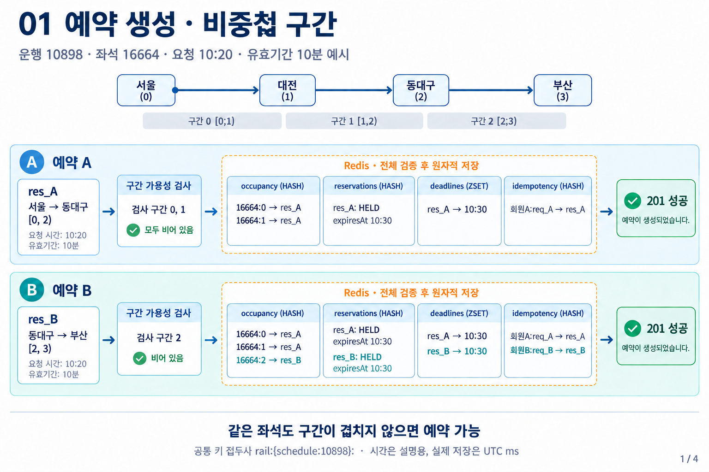
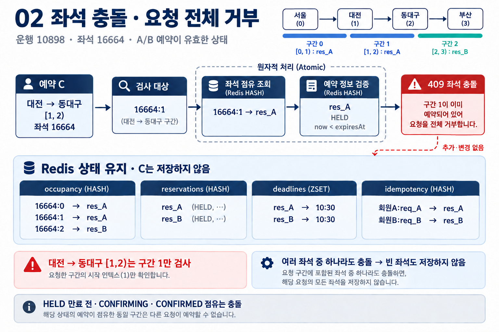
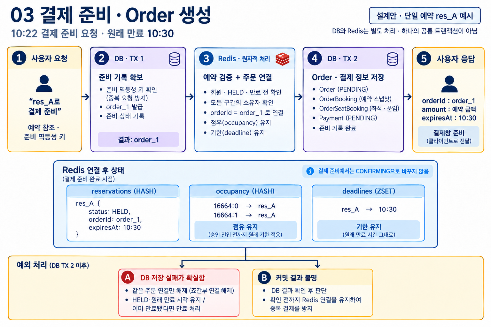
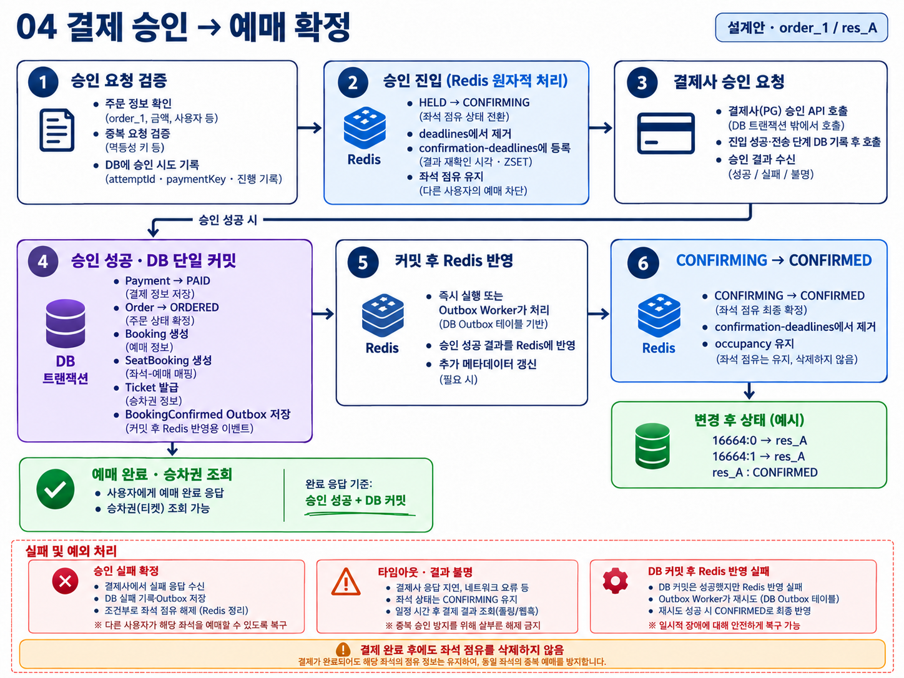

# 예약·결제 흐름도

첨부 스케치를 바탕으로 내장 image_gen으로 생성·수정했다. 결제 준비·완료는 구현 완료가 아닌 설계안이다.

시각은 설명용이다. 10:20 생성에 유효기간 10분을 적용해 10:30 만료로 표시했다. 실제 시각은 UTC ms로 저장한다. idempotency 값은 그림에서 예약 ID만 표시했으며 실제로는 요청 해시·완료 여부도 저장한다. 예약 생성의 전체 검증과 저장은 같은 Redis 원자 실행에 포함된다.

## 1. 예약 생성

## 2. 좌석 충돌

## 3. 결제 준비

## 4. 결제 완료

결제사의 명확한 실패가 확인된 경우에만 조건부 해제를 수행한다. 결과 불명은 CONFIRMING을 유지한다. 승인 성공 후 DB 확정 실패의 복구·취소 보상 상세는 [실패·복구 문서](../10-payment-failure-recovery.md)를 따른다.

[생성 프롬프트](prompts.md)

